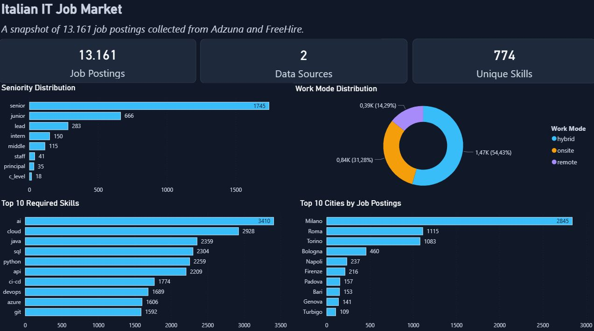
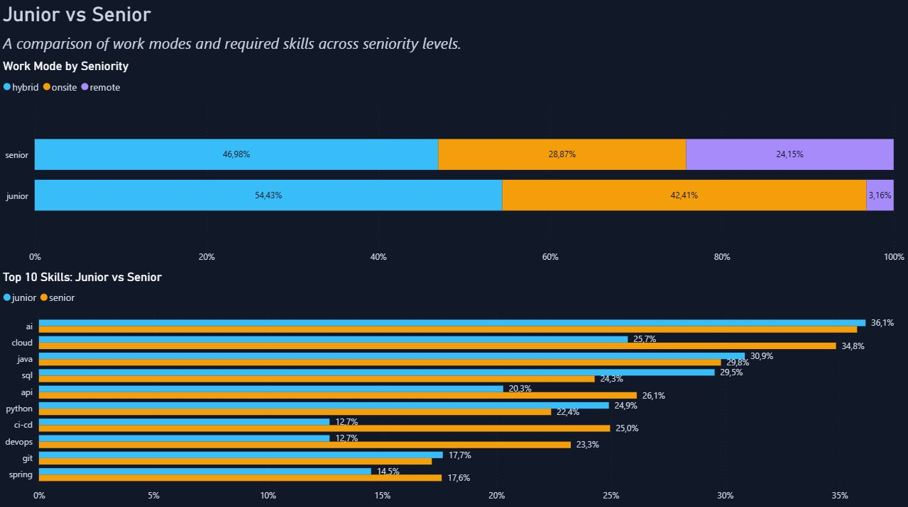

# IT Job Market Data Pipeline

An end-to-end Data Engineering project that collects technology job postings relevant to the Italian market, transforms heterogeneous API data into a shared schema, validates data quality, loads the resulting dataset into PostgreSQL, analyzes it with SQL, and presents selected findings through Power BI.

The project was built from scratch as a portfolio project to practice the complete lifecycle of a data pipeline rather than analyzing a pre-existing dataset.

The current version also provides a reproducible Docker environment for running the ETL pipeline and PostgreSQL database without requiring a local Python or PostgreSQL installation.

---

## Project Status

### Version 1 — Complete

Version 1 implements the complete local pipeline:

```text
External APIs
      ↓
Python Extraction
      ↓
Raw JSON
      ↓
Transformation & Validation
      ↓
Processed JSON
      ↓
PostgreSQL
      ↓
SQL Profiling & Analysis
      ↓
Power BI
```

The Version 1 reference database contains:

| Metric | Value |
| --- | ---: |
| Job postings | 13,161 |
| Adzuna jobs | 3,161 |
| FreeHire jobs | 10,000 |
| Unique skills | 774 |
| Job-skill relationships | 82,262 |

Because the APIs expose live data, new pipeline runs can produce different record counts.

### Version 2 — In Progress

Version 2 focuses on making the pipeline reproducible and deployable.

The Docker milestone is complete:

- Python ETL containerized;
- PostgreSQL containerized;
- multi-service orchestration with Docker Compose;
- persistent PostgreSQL storage;
- automatic schema initialization;
- PostgreSQL health checks;
- environment-based configuration;
- reproducible dependency versions;
- automatic `extract → transform → load` execution;
- safe failure propagation;
- validated fresh-clone execution.

The next milestone is cloud deployment with Microsoft Azure.

---

## Dashboard

The Version 1 dataset is explored through a two-page Power BI report.

### Overview

The first page provides a high-level view of the dataset, including:

- job-posting count;
- source composition;
- seniority distribution;
- work-mode distribution;
- most frequent structured skills;
- most frequent derived cities.



### Junior vs Senior

The second page compares Junior and Senior postings across:

- work-mode distribution;
- structured skill prevalence.



The report is stored in:

```text
powerbi/it_job_market_dashboard.pbix
```

Analyses involving skills, seniority, or work mode use only records where the relevant structured fields are available.

The dashboard should therefore be interpreted as an analysis of the collected dataset rather than a statistically representative estimate of the entire Italian technology labour market.

---

# Architecture

## Data Pipeline

```text
                 External APIs
                /             \
               /               \
          Adzuna              FreeHire
               \               /
                \             /
                 ▼           ▼
                   Extraction
                       │
                       ▼
                    Raw JSON
                       │
                       ▼
             Transformation Layer
                       │
              Cleaning & Validation
                       │
                       ▼
                 Processed JSON
                       │
                       ▼
                   PostgreSQL
                  /          \
                 /            \
                ▼              ▼
         SQL Profiling     SQL Analysis
                                │
                                ▼
                             Power BI
```

The pipeline separates ingestion, transformation, storage, analysis, and visualization so that each stage can be inspected and executed independently.

---

## Docker Architecture

Version 2 packages the runtime environment with Docker.

```text
                         Docker Compose
                               │
               ┌───────────────┴───────────────┐
               │                               │
               ▼                               ▼
         ETL Container                 PostgreSQL Container
       Python 3.14.7                     PostgreSQL 18.6
               │                               │
               │        Docker Network         │
               └──────────────────────────────►│
                                               │
                                               ▼
                                      PostgreSQL Volume
                                       persistent state

               ▲
               │
         Bind Mount
               │
               ▼
        Host ./data/
```

The ETL and database run as separate services.

The ETL container is temporary and can be recreated for every pipeline run.

PostgreSQL state is stored in a Docker-managed named volume so that destroying and recreating the database container does not destroy the database.

Raw and processed JSON files remain accessible on the host through a bind mount.

---

# Data Sources

## Adzuna

Adzuna provides a broad sample of IT job postings from the Italian market.

The extraction layer handles:

- API authentication;
- pagination;
- request timeouts;
- retries;
- HTTP response validation;
- transient HTTP failures;
- repeated job IDs across pages;
- pagination saturation.

Transient responses currently retried include:

```text
429
502
503
504
```

If extraction still fails after the configured retry attempts, the script terminates with an error.

This behavior is important because an incomplete extraction must not silently continue into transformation and database loading.

Adzuna can also return repeated records across pages. Source job IDs are therefore tracked during extraction.

If a page contains no previously unseen IDs, extraction stops rather than continuing indefinitely through duplicated pages.

---

## FreeHire

FreeHire provides technology-related job postings associated with Italy and exposes additional structured information such as:

- skills;
- seniority;
- work mode;
- city information.

The current extraction collects records in batches of 100 up to the first 10,000 records supported by the API's deep-pagination constraint.

---

## Heterogeneous Source Schemas

The two APIs describe similar concepts using different structures and different levels of completeness.

The extraction layer preserves each source independently.

The transformation layer is responsible for converting both sources into a common schema.

---

# Extraction

Extraction is implemented in:

```text
src/extract.py
```

The extraction layer is responsible for:

- requesting data from each API;
- handling source-specific pagination;
- retrying temporary failures;
- validating HTTP responses;
- detecting repeated source IDs;
- preserving API responses as raw JSON.

Generated raw files are stored in:

```text
data/raw/
├── adzuna_jobs.json
└── freehire_jobs.json
```

Raw records are preserved before cleaning.

This allows transformation logic to be rerun without repeatedly calling external APIs and keeps the original collected data available for debugging.

If the required data directories do not exist, the pipeline creates them automatically.

---

# Transformation

Transformation is implemented in:

```text
src/transform.py
```

Both sources are mapped to the following common representation:

```text
source_job_id
source
title
company
location
city
salary_min
salary_max
skills
seniority
work_mode
published_date
```

The transformation layer performs:

- source-specific field mapping;
- within-source deduplication;
- missing-value normalization;
- publication-date parsing;
- salary-range validation;
- categorical validation;
- city derivation and normalization;
- required-field validation;
- known non-job record filtering;
- integration of both sources.

The final processed dataset is written to:

```text
data/processed/jobs.json
```

---

## Source Identity

Each job retains the pair:

```text
(source, source_job_id)
```

as its source-level identity.

External IDs are not assumed to be globally unique because different providers operate in separate namespaces.

Version 1 performs deduplication within each source.

Cross-source entity resolution is intentionally not performed because determining whether two postings from different APIs represent the same real-world vacancy would require additional matching logic and assumptions.

---

# Data Quality Findings

Data profiling is treated as part of the pipeline development process rather than only as a final analytical step.

Several transformation rules were introduced only after anomalies were discovered in the loaded dataset.

---

## Non-job Adzuna Records

SQL profiling revealed an unexpected historical concentration of Adzuna records associated with a company named:

```text
Ernesto
```

Investigation showed that these records were customer service requests rather than employment vacancies.

They shared both:

```text
company = "Ernesto"
```

and titles beginning with:

```text
"I nostri clienti hanno richiesto"
```

A conservative filter was introduced using both conditions.

The rule deliberately avoids broader keyword-based filtering that could accidentally remove legitimate jobs.

This issue was discovered after the data had already been loaded and profiled, producing the feedback loop:

```text
ETL
 ↓
PostgreSQL
 ↓
Profiling
 ↓
Data-quality anomaly
 ↓
Transformation fix
 ↓
Reload
 ↓
Validation
```

---

## Location and City

Location values have inconsistent granularity across providers.

The pipeline therefore preserves the raw:

```text
location
```

while deriving a separate:

```text
city
```

field for analysis.

FreeHire exposes structured city information.

A city is accepted only when exactly one usable city is available.

Adzuna does not expose an equivalent structured city field, so a conservative heuristic is applied to the displayed location.

Ambiguous values are kept missing rather than guessed.

---

## BI Validation Feedback Loop

Power BI validation exposed a discrepancy between a dashboard city count and an exact PostgreSQL query.

Further profiling identified case variants such as:

```text
Torino
torino
```

Rather than correcting the visualization, city normalization was fixed upstream in the transformation layer.

The pipeline was then rerun and both PostgreSQL and Power BI produced matching results.

This reinforced a general project rule:

> Data-quality problems should be corrected as far upstream as reasonably possible rather than hidden in downstream analysis.

---

## Salary

Salary values are preserved when available.

However, coverage is limited and the available source fields do not always provide enough information to determine the meaning or periodicity of the values safely.

Salary analysis is therefore intentionally excluded from the Version 1 dashboard rather than applying arbitrary normalization assumptions.

---

## Uneven Field Coverage

Structured fields are not available uniformly across sources.

In particular:

- structured skill coverage differs significantly between providers;
- seniority is available only for a subset of records;
- work mode is available only for a subset of records;
- salary coverage is incomplete;
- geographic precision varies between sources.

Analyses involving these fields describe only the subset for which usable data exists.

---

# PostgreSQL Data Model

The relational schema is defined in:

```text
sql/schema.sql
```

The database contains three tables:

```text
jobs
├── job_id (PK)
├── source_job_id
├── source
├── title
├── company
├── location
├── city
├── salary_min
├── salary_max
├── seniority
├── work_mode
└── published_date


skills
├── skill_id (PK)
└── skill_name (UNIQUE)


job_skills
├── job_id (PK, FK)
└── skill_id (PK, FK)
```

Jobs and skills form a many-to-many relationship.

A job can contain multiple skills and the same skill can appear in multiple jobs.

The relationship is therefore represented through the junction table:

```text
job_skills
```

rather than storing skill arrays directly in the `jobs` table.

The pair:

```text
(source, source_job_id)
```

is constrained to be unique.

---

# Database Initialization

When using Docker Compose, the PostgreSQL schema is initialized automatically.

The repository file:

```text
sql/schema.sql
```

is mounted inside the PostgreSQL container at:

```text
/docker-entrypoint-initdb.d/01-schema.sql
```

The official PostgreSQL image executes initialization scripts in this directory when a new empty database volume is created.

This allows a fresh project environment to create its database schema without manually entering PostgreSQL or executing SQL commands.

Initialization scripts are not rerun when an existing PostgreSQL volume is reused.

---

# Loading Strategy

Loading is implemented in:

```text
src/load.py
```

The project currently uses a full-refresh strategy.

Before loading the processed dataset, PostgreSQL executes:

```sql
TRUNCATE job_skills, jobs, skills RESTART IDENTITY;
```

The refresh and subsequent inserts execute inside the same database transaction.

The transaction is committed only after the load completes successfully.

If an exception occurs, the transaction is rolled back.

This prevents the database from being left in a partially refreshed state.

The loader also validates fields mapped to scalar PostgreSQL columns before insertion.

---

# Pipeline Failure Safety

The complete Docker pipeline executes:

```text
extract
   &&
transform
   &&
load
```

The shell `&&` operator means that each stage runs only when the previous stage exits successfully.

Extraction errors therefore propagate as non-zero process exit codes.

The resulting behavior is:

```text
Successful extraction
        ↓
Transformation
        ↓
Load
```

while:

```text
Failed extraction
        ↓
Pipeline stops
        ↓
Transformation not executed
        ↓
Load not executed
        ↓
Existing database remains unchanged
```

This behavior was explicitly tested using invalid API credentials.

---

# SQL Profiling

Profiling queries are stored in:

```text
sql/data_profiling.sql
```

Profiling covers areas including:

| Area | Purpose |
| --- | --- |
| Source composition | Understand dataset balance |
| Missing values | Measure field coverage |
| Duplicate IDs | Validate source identity |
| Seniority | Inspect available categories |
| Work mode | Inspect available categories |
| Publication dates | Inspect temporal coverage |
| Salary | Measure coverage and suspicious values |
| Skills | Measure structured skill coverage |

Profiling is kept separate from analytical SQL.

Its purpose is to understand what the dataset can reliably support before drawing conclusions from it.

---

# SQL Analysis

Analytical queries are stored in:

```text
sql/analysis.sql
```

The analysis includes:

| Analysis | Question |
| --- | --- |
| Top cities | Where are the most postings located? |
| Top skills | Which structured skills appear most frequently? |
| Work-mode distribution | How are hybrid, onsite, and remote postings distributed? |
| Seniority distribution | How are available seniority categories distributed? |
| Junior skills | Which skills appear most frequently in junior postings? |
| Junior vs Senior skills | How does skill prevalence differ by seniority? |
| Work mode by seniority | Does work-mode distribution differ between junior and senior jobs? |
| Skill co-occurrence | Which skill pairs most frequently appear together? |

The SQL layer exercises:

```text
JOIN
many-to-many relationships
COUNT(DISTINCT ...)
FILTER
CTEs
window functions
PARTITION BY
CROSS JOIN
self-joins
```

---

## Selected Version 1 Findings

The frozen Version 1 snapshot produced the following results:

| Finding | Result |
| --- | ---: |
| Most frequent derived city | Milano — 2,845 postings |
| Most frequent structured skill | AI — 3,410 postings |
| Cloud | 2,928 postings |
| Java | 2,359 postings |
| SQL | 2,304 postings |
| Python | 2,259 postings |
| Most frequent skill pair | AI + Cloud — 1,436 postings |
| Python + AI | 1,175 postings |

The available Junior and Senior subsets also showed different work-mode distributions:

| Seniority | Hybrid | Onsite | Remote |
| --- | ---: | ---: | ---: |
| Junior | 54.43% | 42.41% | 3.16% |
| Senior | 46.98% | 28.87% | 24.15% |

These percentages refer only to records where both seniority and work-mode information were available.

They are not population-level estimates of the Italian job market.

---

# Power BI

Power BI uses the PostgreSQL relational model as its analytical source.

The model imports:

```text
jobs
skills
job_skills
```

with one-to-many relationships from both `jobs` and `skills` to the `job_skills` junction table.

The current report contains two pages.

## Overview

Includes:

- job-posting count;
- number of sources;
- number of unique structured skills;
- seniority distribution;
- work-mode distribution;
- top structured skills;
- top derived cities.

## Junior vs Senior

Compares:

- work-mode distribution;
- structured skill prevalence.

Power BI is intentionally not used to compensate for data-quality issues that can be corrected upstream.

---

# Project Structure

```text
it-job-market-analytics/
│
├── src/
│   ├── extract.py
│   ├── transform.py
│   └── load.py
│
├── sql/
│   ├── schema.sql
│   ├── data_profiling.sql
│   └── analysis.sql
│
├── powerbi/
│   └── it_job_market_dashboard.pbix
│
├── docs/
│   └── images/
│       ├── overview.jpg
│       └── junior_vs_senior.jpg
│
├── data/
│   ├── raw/
│   └── processed/
│
├── Dockerfile
├── compose.yaml
├── .dockerignore
├── .env.example
├── requirements.txt
├── .gitignore
└── README.md
```

Raw and processed datasets are generated at runtime and are not committed to Git.

The real `.env` file is also excluded from version control.

`.env.example` documents the required configuration without exposing credentials.

---

# Running the Project

## Recommended Method — Docker Compose

Docker Compose is the recommended way to run the project.

### Requirements

You need:

```text
Git
Docker
Docker Compose
Adzuna API credentials
```

A local Python installation and local PostgreSQL installation are not required.

---

## 1. Clone the Repository

```bash
git clone <repository-url>
cd it-job-market-analytics
```

---

## 2. Create the Environment File

Linux/macOS:

```bash
cp .env.example .env
```

Windows PowerShell:

```powershell
Copy-Item .env.example .env
```

Configure `.env`:

```env
ADZUNA_APP_ID=your_adzuna_app_id
ADZUNA_APP_KEY=your_adzuna_app_key

DB_HOST=127.0.0.1
DB_PORT=5433
DB_NAME=it_job_market
DB_USER=postgres
DB_PASSWORD=your_password
```

`DB_HOST` and `DB_PORT` describe host-side access.

Inside the Docker network, Compose overrides them for the ETL service so that PostgreSQL is reached through:

```text
postgres:5432
```

---

## 3. Run the Complete Pipeline

```bash
docker compose run --rm etl
```

On the first execution Docker Compose will:

```text
build ETL image
      ↓
create Docker network
      ↓
create PostgreSQL volume
      ↓
start PostgreSQL
      ↓
initialize schema
      ↓
wait for PostgreSQL health check
      ↓
run extract.py
      ↓
run transform.py
      ↓
run load.py
```

The project has been validated using this procedure from a fresh repository clone with:

- no project virtual environment;
- no existing project database;
- no existing project Docker volume;
- no manually created Docker network;
- no local PostgreSQL setup.

---

## Running Individual Pipeline Stages

Extraction only:

```bash
docker compose run --rm etl python src/extract.py
```

Transformation only:

```bash
docker compose run --rm etl python src/transform.py
```

Loading only:

```bash
docker compose run --rm etl python src/load.py
```

These commands are useful while developing or debugging individual stages.

---

## Stopping the Environment

Stop and remove the Compose containers and network:

```bash
docker compose down
```

The PostgreSQL volume is preserved.

---

## Resetting the Database

To also delete the persistent PostgreSQL volume:

```bash
docker compose down -v
```

The next run will create a new database volume and execute:

```text
sql/schema.sql
```

again automatically.

---

# Local Execution Without Docker

The pipeline can still be run directly on the host.

Requirements:

```text
Python
PostgreSQL
Adzuna API credentials
```

Install dependencies:

```bash
pip install -r requirements.txt
```

Create a `.env` file using:

```text
.env.example
```

as the template.

Create the PostgreSQL database and apply:

```text
sql/schema.sql
```

Then execute:

```bash
python src/extract.py
python src/transform.py
python src/load.py
```

---

# SQL and Power BI

Once PostgreSQL has been populated, the profiling and analytical queries can be executed from:

```text
sql/data_profiling.sql
sql/analysis.sql
```

The Power BI report can be opened from:

```text
powerbi/it_job_market_dashboard.pbix
```

Power BI Desktop may require the PostgreSQL connection to be configured for the machine running the report.

---

# Docker Implementation Details

## ETL Image

The ETL image is built from:

```text
Dockerfile
```

using:

```text
Python 3.14.7
```

The image contains:

- Python;
- project dependencies;
- ETL source code.

The dependency versions used by the project are pinned in:

```text
requirements.txt
```

to improve reproducibility.

---

## PostgreSQL Service

PostgreSQL runs using:

```text
PostgreSQL 18.6
```

The database service exposes PostgreSQL to the host while also being reachable internally through the Compose network.

The ETL service accesses it using:

```text
DB_HOST=postgres
DB_PORT=5432
```

---

## PostgreSQL Health Check

The PostgreSQL service includes a health check based on:

```text
pg_isready
```

The ETL service depends on PostgreSQL reaching the:

```text
healthy
```

state.

This avoids relying on arbitrary sleep times before database operations.

---

## Persistent Database Storage

PostgreSQL uses a Docker named volume.

This separates database state from the lifecycle of an individual container.

A PostgreSQL container can therefore be removed and recreated while keeping the existing database.

---

## Bind-mounted Pipeline Data

The host directory:

```text
./data
```

is mounted inside the ETL container at:

```text
/app/data
```

This keeps raw and processed JSON files outside temporary ETL containers.

During development:

```text
./src
```

is also mounted read-only into the ETL container so that source-code changes can be tested without rebuilding the image for every modification.

---

# Technology Stack

| Technology | Purpose |
| --- | --- |
| Python 3.14.7 | ETL implementation |
| Requests | API ingestion |
| Pandas | Transformation and validation |
| JSON | Raw and processed persistence |
| PostgreSQL 18.6 | Relational database |
| Psycopg | Python/PostgreSQL integration |
| SQL | Profiling and analysis |
| Power BI | Visualization |
| python-dotenv | Environment configuration |
| Docker | Containerized runtime |
| Docker Compose | Multi-service orchestration |
| Git | Version control |
| GitHub | Repository and documentation |

---

# Key Engineering Decisions

| Decision | Reason |
| --- | --- |
| Preserve raw API responses | Keep ingestion traceable and transformations rerunnable |
| Separate extraction and transformation | Maintain explicit pipeline responsibilities |
| Use source-specific extraction logic | APIs expose different schemas and pagination models |
| Deduplicate after extraction | Preserve what the APIs actually returned |
| Preserve `(source, source_job_id)` | Provider IDs belong to separate namespaces |
| Avoid cross-source entity resolution | Reliable matching would require additional assumptions |
| Normalize skills relationally | Jobs and skills form a genuine many-to-many relationship |
| Preserve missing data | Missing information is preferable to invented information |
| Derive cities conservatively | Location values have inconsistent granularity |
| Correct data-quality problems upstream | Downstream visualization should not hide pipeline problems |
| Exclude unreliable salary analysis | Available salary semantics are insufficient for safe normalization |
| Use a full-refresh load | Current dataset size does not require incremental loading |
| Use database transactions | Prevent partially refreshed database states |
| Separate ETL and PostgreSQL containers | Application execution and persistent database state have different lifecycles |
| Use a PostgreSQL named volume | Database data must survive container recreation |
| Use bind mounts for pipeline outputs | Raw and processed files should remain accessible on the host |
| Initialize the schema automatically | Fresh environments should not require manual SQL setup |
| Use PostgreSQL health checks | Container startup does not necessarily mean database readiness |
| Propagate extraction failures | Partial extractions must not overwrite a valid database |
| Pin runtime versions | Rebuilds should use known working versions |
| Avoid fixed container names | Multiple copies of the project should be able to run independently |
| Avoid unnecessary technologies | Tools are added only when they solve a concrete project problem |

---

# Docker Validation

The Docker setup was tested from a separate fresh clone of the repository.

The test started without:

```text
project database
project PostgreSQL volume
project Docker network
local virtual environment
generated data directories
```

Running:

```bash
docker compose run --rm etl
```

successfully:

1. built the ETL image;
2. created the Docker network;
3. created the PostgreSQL volume;
4. initialized the PostgreSQL schema;
5. waited for PostgreSQL to become healthy;
6. created the required data directories;
7. extracted API data;
8. transformed and validated the dataset;
9. loaded the data into PostgreSQL.

This test is used as the reproducibility check for the Docker milestone.

---

# Current Limitations

The dataset and pipeline still have several known limitations.

### Data

- The two APIs provide different field coverage.
- Structured skills are not uniformly available.
- Seniority and work mode are incomplete.
- Salary coverage and semantics remain unreliable.
- Geographic values have inconsistent source granularity.
- Cross-source entity resolution is not implemented.
- FreeHire extraction is limited to the first 10,000 records supported by its deep-pagination behavior.
- The dataset represents pipeline snapshots rather than a historical time series.

### Pipeline

- There is currently no automated test suite.
- Adzuna can occasionally return temporary HTTP failures.
- Retry logic mitigates temporary API errors but does not persist extraction checkpoints between runs.
- The pipeline currently performs full-refresh loading rather than incremental ingestion.
- Execution is manually triggered rather than scheduled.

### Deployment

- Docker currently runs locally.
- Azure deployment is not yet implemented.
- Power BI is not containerized and remains a desktop analytical layer.

---

# Version History

## Version 1 — Complete

Version 1 established the full end-to-end data workflow.

| Milestone | Status |
| --- | :---: |
| API investigation | ✅ |
| Multi-source extraction | ✅ |
| Raw JSON persistence | ✅ |
| Transformation | ✅ |
| Data validation | ✅ |
| Data-quality filtering | ✅ |
| PostgreSQL relational model | ✅ |
| Transactional database loading | ✅ |
| SQL profiling | ✅ |
| SQL analysis | ✅ |
| Power BI dashboard | ✅ |
| Documentation | ✅ |

---

## Version 2 — In Progress

### Docker Milestone

| Milestone | Status |
| --- | :---: |
| ETL Docker image | ✅ |
| PostgreSQL container | ✅ |
| Persistent database volume | ✅ |
| Container networking | ✅ |
| Docker Compose orchestration | ✅ |
| Environment configuration | ✅ |
| Automatic schema initialization | ✅ |
| PostgreSQL health check | ✅ |
| Complete ETL command | ✅ |
| Pipeline failure propagation | ✅ |
| Runtime version pinning | ✅ |
| Fresh-clone reproducibility test | ✅ |

### Azure Milestone

| Milestone | Status |
| --- | :---: |
| Azure architecture design | ⏳ |
| Cloud resource selection | ⏳ |
| Cloud deployment | ⏳ |
| Cloud execution validation | ⏳ |

---

# Future Improvements

Potential future iterations include:

- automated unit and integration tests;
- historical snapshot collection;
- extraction checkpointing and resume support;
- incremental loading;
- cross-source entity resolution;
- improved geographic normalization;
- improved salary normalization if source semantics allow it;
- automated scheduling;
- CI/CD;
- monitoring and structured logging;
- cloud deployment on Microsoft Azure.

These improvements will be added only when they solve a concrete limitation or provide a useful learning objective.